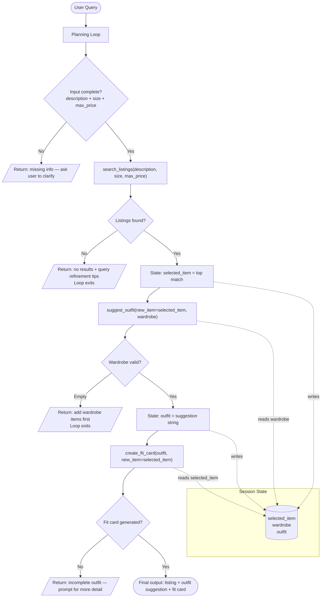

# FitFindr — planning.md

> Complete this document before writing any implementation code.
> Your spec and agent diagram are what you'll use to direct AI tools (Claude, Copilot, etc.) to generate your implementation — the more specific they are, the more useful the generated code will be.
> Your planning.md will be reviewed as part of your submission.
> Update it before starting any stretch features.

---

## Tools

List every tool your agent will use. For each tool, fill in all four fields.
You must have at least 3 tools. The three required tools are listed — add any additional tools below them.

### Tool 1: search_listings

**What it does:**
Given a user-inputted query, this tool should scan for all listings and rank the ones that most closely match the description given. Then, it should return the best match.  

**Input parameters:**
<!-- List each parameter, its type, and what it represents -->
- `description` (str): The type of clothing the user wants to look for. Include color, attire type, and other details. 
- `size` (str): The size of clothing the user is looking for. 
- `max_price` (float): The maximum price the user is willing to pay for the clothing. 

**What it returns:**
Returns a `dict` with four keys — `title` (str), `price` (float), `platform` (str), and `condition` (str) — representing the single best-matching listing.

**What happens if it fails or returns nothing:**
If no listings match, the model should provide suggestions to the user to improve their query. For example, using alternative names for the item they are looking for, or reducing the specificity of their search. 

---

### Tool 2: suggest_outfit

**What it does:**
Given a new piece of clothing, the tool should suggest pieces from the user's current wardrobe that they can pair it with. It should also provide styling suggestions. 

**Input parameters:**
<!-- List each parameter, its type, and what it represents -->
- `new_item` (dict): The new item that the user needs help findings outfits for. 
- `wardrobe` (dict): A dictionary including multiple clothing items, which the user already has in their possession. 

**What it returns:**
Returns a `str` — 2–3 sentences naming specific wardrobe items to pair with the new piece and describing how to style the combination.

**What happens if it fails or returns nothing:**
If the wardrobe is empty, tell the user to add clothing items. If no outfit is suggested, prompt the user for more clothing items for a better variety of outfits and suggest that they adjust their new item to fit the current wardrobe style more. 

---

### Tool 3: create_fit_card

**What it does:**
Generates a short and digestable description of an outfit that the user can easily share on social media. 

**Input parameters:**
<!-- List each parameter, its type, and what it represents -->
- `outfit` (str): A string describing an outfit. The user can use the string returned from suggest_outfit() here. 
- `new_item` (dict): The new clothing that the user is pairing in the outfit. Highlight this piece in the description. 

**What it returns:**
Returns a `str` — a single short caption (1–3 sentences with relevant hashtags) suitable for sharing directly to social media, with the new item highlighted.

**What happens if it fails or returns nothing:**
If the outfit data is incomplete, prompt the user for another outfit description and provide suggestions on how to improve on their current suggestions. 

---

### Additional Tools (if any)

<!-- Copy the block above for any tools beyond the required three -->

---

## Planning Loop

**How does your agent decide which tool to call next?**
<!-- Describe the logic your planning loop uses. What does it look at? What conditions change its behavior? How does it know when it's done? -->
When the user asks the model to find an item, call search_listings with the description, size, and max_price that the user specified. If part of the description is missing or no listings are found, then return an error message and end the loop early. Otherwise, return the listing with the highest match and set selected_item to this listing. Then, proceed to suggest_outfit using the listing that the user found from search_listings. If an error is encountered, return the appropriate error message and end the loop. Otherwise, proceed to create_fit_card using the outfit generated as well as selected_item. If there is an error, then return the appropriate error message. Otherwise, the loop is done. 
---

## State Management

**How does information from one tool get passed to the next?**

The agent maintains a session state dictionary with three keys:

- `selected_item` — set after `search_listings` succeeds; holds the full listing dict (title, price, platform, condition). Passed as `new_item` into `suggest_outfit` and `create_fit_card`.
- `wardrobe` — loaded at session start from the user's saved wardrobe data; read by `suggest_outfit` but never modified within a session.
- `outfit` — set after `suggest_outfit` succeeds; holds the suggestion string. Passed as `outfit` into `create_fit_card`.

Each tool receives only the state keys it needs. If a required key is missing (e.g., `selected_item` is `None` because `search_listings` failed), the loop exits early before calling the next tool.

---

## Error Handling

For each tool, describe the specific failure mode you're handling and what the agent does in response.

| Tool | Failure mode | Agent response |
|------|-------------|----------------|
| search_listings | No results match the query | Returns a message telling the user no listings were found, then suggests refining the query — try broader terms, alternative item names (e.g. "tee" instead of "graphic tee"), or relaxing the price/size filters. Loop exits early; `selected_item` stays `None`. |
| suggest_outfit | Wardrobe is empty | Returns a message asking the user to add clothing items to their wardrobe before requesting outfit suggestions. Loop exits early; `create_fit_card` is never called. |
| create_fit_card | Outfit input is missing or incomplete | Returns a message asking the user to provide a more complete outfit description and offers examples based on the `new_item` details already available. |

---

## Architecture

---

## AI Tool Plan

<!-- For each part of the implementation below, describe:
     - Which AI tool you plan to use (Claude, Copilot, ChatGPT, etc.)
     - What you'll give it as input (which sections of this planning.md, your agent diagram)
     - What you expect it to produce
     - How you'll verify the output matches your spec before moving on

     "I'll use AI to help me code" is not a plan.
     "I'll give Claude my Tool 1 spec (inputs, return value, failure mode) and ask it to implement
     search_listings() using load_listings() from the data loader — then test it against 3 queries
     before trusting it" is a plan. -->

**Milestone 3 — Individual tool implementations:**

- **search_listings:** I will give Claude the Tool 1 spec (inputs: `description`, `size`, `max_price`; return value: a listing dict with title, price, platform, condition; failure mode: no results found) and ask it to implement `search_listings()` using the provided data loader. Then, I will test it against three queries: one that matches multiple listings, one that matches nothing, and one with a missing size. I will verify the return format and error messages match the spec before moving on.

- **suggest_outfit:** I will give Claude the Tool 2 spec along with a sample `wardrobe` dict and a sample `new_item` and ask it to implement `suggest_outfit()`. I will then test it with a populated wardrobe, an empty wardrobe, and a wardrobe that has no good matches, confirming the output sentence and error messages are correct in each case.

- **create_fit_card:** I will give Claude the Tool 3 spec with a sample `outfit` string and `new_item` dict and ask it to implement `create_fit_card()`. I will verify the returned string highlights the new item, is concise (suitable for social media), and triggers the right error when `outfit` is incomplete.

**Milestone 4 — Planning loop and state management:**

I'll share the Planning Loop section, the State Management section, and the Architecture diagram with Claude and ask it to wire the three tools into a single loop function. I'll trace through the full example interaction step by step — checking that `selected_item` and `outfit` are correctly written to and read from state — then manually trigger each early-exit error path (no results, empty wardrobe, incomplete outfit) to confirm the loop terminates correctly without calling downstream tools.

---

## A Complete Interaction (Step by Step)

Write out what a full user interaction looks like from start to finish — tool call by tool call. Use a specific example query.

**Example user query:** "I need a size medium oversized blazer under $50. I usually wear fitted trousers and loafers. What can I find and how should I style it?"

**Step 1:**
The agent calls `search_listings(description="oversized blazer", size="M", max_price=50.0)`. It scans all available listings and ranks them by relevance. The top match is returned: `{"title": "Vintage Plaid Oversized Blazer", "price": 38.00, "platform": "Poshmark", "condition": "Like New"}`. This result is stored in state as `selected_item`.

**Step 2:**
With `selected_item` set, the agent calls `suggest_outfit(new_item=selected_item, wardrobe={"black_fitted_trousers": "...", "tan_loafers": "...", "white_ribbed_tank": "..."})`. The tool returns: *"Layer your plaid oversized blazer over the white ribbed tank and pair it with your black fitted trousers and tan loafers for a polished-casual look. Leave the blazer unbuttoned and cuff the sleeves once for a relaxed, intentional finish."* This string is stored in state as `outfit`.

**Step 3:**
The agent calls `create_fit_card(outfit=<outfit string from Step 2>, new_item=selected_item)`. It returns a short, shareable caption: *"Snagged this vintage plaid blazer on Poshmark for $38 and it's doing all the heavy lifting — ribbed tank, fitted trousers, loafers, done. #ThriftedFit #BlazerSzn #OOTD"*

**Final output to user:**
The agent presents all three results in a single response:
1. **Listing found:** Vintage Plaid Oversized Blazer — $38.00 on Poshmark, condition: Like New
2. **Outfit suggestion:** layer over a white ribbed tank with black fitted trousers and tan loafers; cuff the sleeves for a relaxed finish
3. **Fit card:** the shareable social media caption, ready to copy and post
